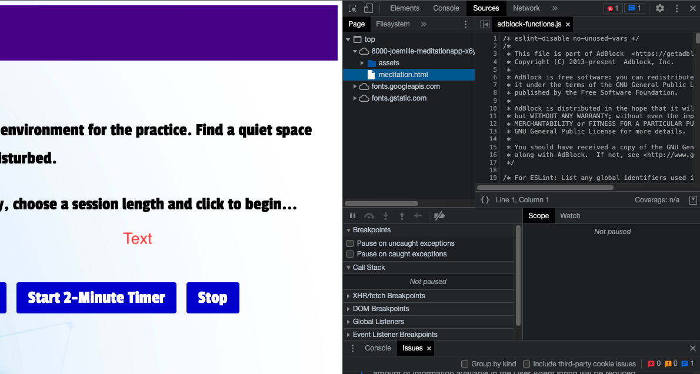
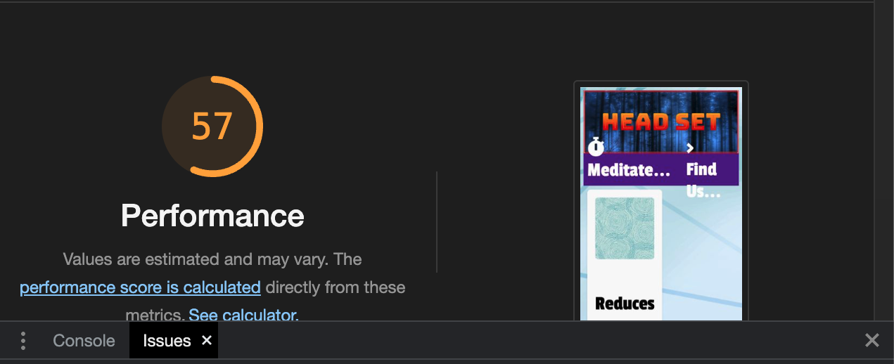
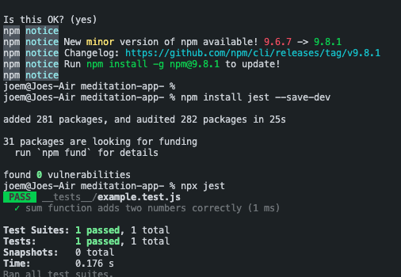
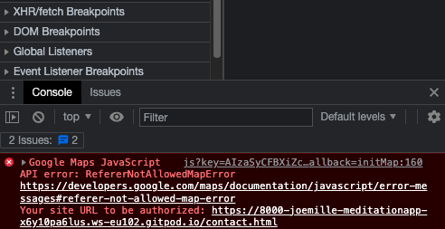
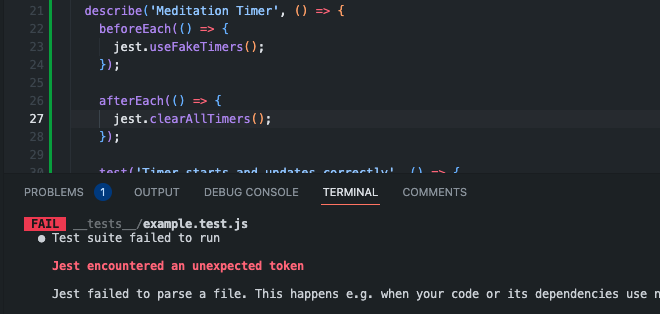

# Headset Meditation App

## Description
The following project is a false page for a simple meditation application. 
Using Javascript, HTML and CSS code for all three pages, as well as Jquery and Google Maps API software. 
The purpose of the Headset application is to showcase the understanding of fundamental JS HTML and CSS principles.
By using lessons from Code Institute, Giraffe Academy, W3 Schools and a host of online rescources. 
This project comes after a staggered halt to education for nearly a year, meaning that the majority of the HTML and CSS code 
fundamentals gathered during the creation of Milestone Project 1 had been largely forgotten. The goal of this project although
designed to embody the principles of design taught in Project 1, was more focused towards writing leggible and functioning custom Javascript code which when deployed behaves as expected.  

## User Stories
This project acts as a simple meditation timer which when activated provides a comforting background sound and a visual aid
to concentrate on in the form of messages displayed to the user. The goals of this free online tool are as listed from the 
perspective of a prospective user who aims to find a short window of time in the day to center themselves and meditate:
* Replace the need for a paid meditation app, these are costly and provide the same basic service.
* Find content on each section of the site easy to navigate and quick to understand.
* Be able to locate the fictional owners easy when viewing the contact page.

From the perspective of the developer the main objectives of Head Set meditation application are:
* Primarily, to showcase a product which relies on custom Javascript for its main function 
* Executes its purpose as intended 
* Is enjoyable and similarly easy to navigate across all devices 
* Gives users a service free of charge for a function that could be beneficial when beginning their meditative journey.

## Design Choices
The main purpose of the design is to highlight a relaxed aesthetic and provide a comfortable digital environment 
to take up to five minutes from the users daay to meditate. With the use of varying properties and functions, demonstrating
a fundamental understanding of Javascript concepts as well as HTML and CSS literacy. Using Google Maps API, Bootstrap and Fontawesome.

All functioning parts of the site have been built with Javascript, and the project began based entirely around the first example function

## Testing

Testing JavaScript using Google Developer Tools provides new developers with a powerful set of debugging and profiling tools to inspect code execution, track variable values, and analyze performance bottlenecks. This enabled precise identification and resolution of issues. As always, the first test was a fail due to an AdBlock software preventing the Javascript file from running.

As expected these testing procedures threw up more and more issues as the project became larger. 

Once Javascript was working as expected (or near enough working) it was time to begin testing with Jest. The first test was carried out on a simple maths function to check it was working. 

Moving onto more thorough testing of deployed functions to my page, Google Maps which appears shortly on the Contacts page refused to open. This error took the longest to fix, as after moving across to Visual Studio Code, when previewing the page with an uncleared cache, Google Maps would vanish despite being properly placed. 

Before Javascript could run properly, all syntax errors preventing code to execute were dealt with leaving the front-end of the meditation application working in order. 

## Testing Further...

As well as Developer Tools, Jest, and online code testing tools all code for the Javascript was pushed through the incredibly helpful web-based code tester JS Lint. Once mostly all syntax errors and functions that were impeding other functions from working due to placement had been fixed, all files of the project were pushed through code beautifier tools. By further using Jest to run mock tests on code within my Javascript file, functions could be tested externally and one by one to make sure they worked in succession. 

### Environment Testing 
Environment testing involved thoroughly assessing functionality and performance across varied  setups. This included testing the app on various operating systems, browsers, and devices such as smartphones, tablets, and desktop computers. Continuously resorting to developer tools to help with media query placement and sizing issues. Compatibility issues related to different screen sizes, resolutions, and interaction methods. Additionally, testing the app's audio playback and synchronization with javascript elements on the page, as well as evaluating its responsiveness under different network conditions, makes for a seamless meditation experience for users across different environments. By conducting thorough environment testing, the meditation timer application has been optimized to provide consistent performance and user satisfaction, regardless of the platform or device it is used on.

## Deployment (further)

This project is available to be cloned and ammended as well as improved upon.

To clone this project you will need:

* Github and a Github account.
* A working internet connection.

To ammend or add to, follow these simple steps:

* Sign into your Gitpod account
* Navigate to the XXXXXXX repository.
* Beneath the repository name, click on the "Clone" option, which will open a new Gitpod workspace.
* Inside your terminal, type "git clone", add the Coastal Chef URL and Press Enter.
 

## Summary

Although the syllabus for this project to most students could be described as novice, the second installment of Milestone Projects comes after numerous attempts and fails due to extenuating circumstances. The hope and design behind the Head Set meditation application is not just to provider the user with a simple, easy-to-operate meditation timer; the main intent is to provide working understanding of the HTML CSS and mainly, Javascript, code used throughout. After much trial and failure, and tremendous amounts of repeating lessons and tutorials the Head Set meditation app functions and views as intended across all computing set ups and hopefully demonstrates an understanding of the Javascript concepts it embodies.  

witht the finished product, hopefully quite far from where the project began. 

## Author

Joe Miller  

ChefJoeMiller1992@gmail.com

## Acknowledgments

* [awesome-readme](https://github.com/matiassingers/awesome-readme)
* [W3 Schools](https://www.w3schools.com/css)
* [Code Institute](https://learn.codeinstitute.net/)
* [Stack Overflow](https://stackoverflow.com/questions)
* [Free Code Camp](https://www.freecodecamp.org/)

## Libraries used
* Jquery
* Jest (Testing) 
* Bootstrap
* Font-Awesome
* Google Fonts
* Google Maps API